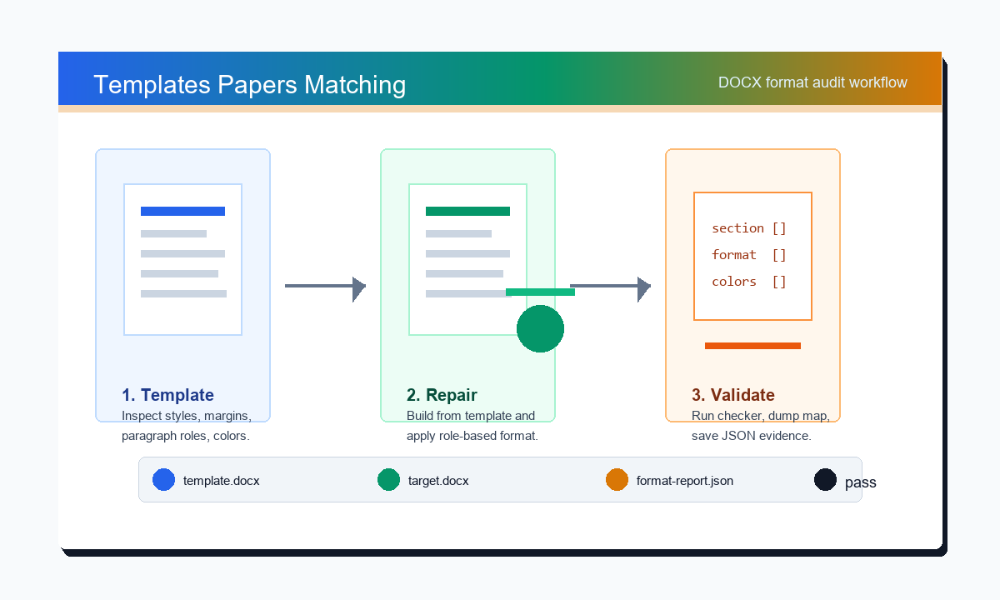

# Templates Papers Matching

一个用于创建、修复和审核模板化论文/报告文档的 Codex Skill。目标是让 `.docx` 成果严格匹配给定模板和提交要求，并输出可复查的格式校验证据。



## 功能

- 以用户提供的模板和提交规则为唯一格式依据。
- 支持检查课程报告、论文、毕业设计文档等模板化 `.docx` 文件。
- 对封面字段、摘要、关键词、一级标题、二级标题、正文、参考文献等角色进行格式比对。
- 检查页面设置、段落格式、可选字体属性和显式颜色。
- 支持输出 JSON 校验报告，方便交付、复查和多轮修复对比。

## 目录结构

- `SKILL.md`：Codex Skill 的触发说明和核心工作流。
- `scripts/compare_docx_template.py`：DOCX 模板格式比对脚本。
- `references/workflow.md`：真实模板匹配任务的操作流程。
- `references/reporting.md`：合规报告和交付摘要写法。
- `assets/workflow-preview.svg`：可编辑的工作流效果图。
- `assets/workflow-preview.png`：渲染后的工作流预览图。
- `agents/openai.yaml`：Skill 的界面元数据。

## 快速使用

运行 DOCX 格式检查：

```powershell
python scripts\compare_docx_template.py `
  --template path\to\template.docx `
  --target path\to\target.docx `
  --check-colors `
  --summary `
  --report path\to\format-report.json
```

打印自动识别的段落角色映射：

```powershell
python scripts\compare_docx_template.py `
  --template path\to\template.docx `
  --target path\to\target.docx `
  --dump-map `
  --summary
```

只检查指定角色，便于定位问题：

```powershell
python scripts\compare_docx_template.py `
  --template path\to\template.docx `
  --target path\to\target.docx `
  --roles h1,h2,ref_item `
  --include-run
```

## 自定义角色映射

如果自动识别的段落位置不符合实际模板结构，可以提供 JSON 映射文件：

```json
{
  "cover_title": [8, 8],
  "topic": [10, 10],
  "article_title": [24, 23],
  "abstract": [28, 27],
  "h1": [31, 30],
  "h2": [35, 36],
  "ref_item": [53, 86]
}
```

然后运行：

```powershell
python scripts\compare_docx_template.py `
  --template path\to\template.docx `
  --target path\to\target.docx `
  --mapping path\to\mapping.json `
  --check-colors `
  --summary
```

映射值格式为 `[模板段落索引, 目标文档段落索引]`。

## 校验 Skill

在 Codex Skill 开发环境中，可以用对应的 `quick_validate.py` 检查 Skill 基础结构：

```powershell
python path\to\skill-creator\scripts\quick_validate.py .
```

DOCX 比对脚本依赖 Python 和 `python-docx`。
